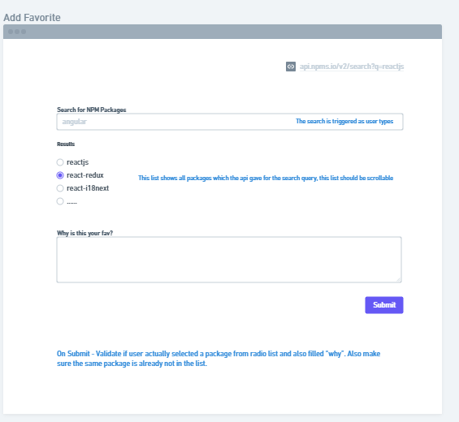
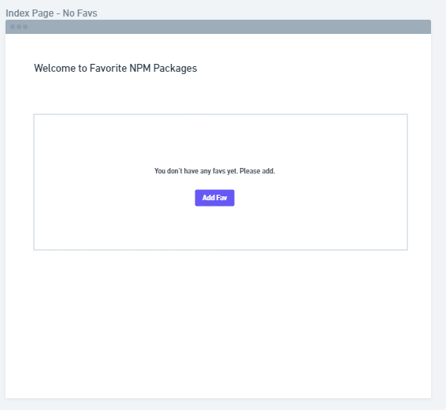
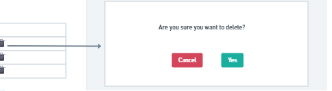

# Package Search

## How The UI should Look

[Demo of Package Search](https://package-oothn2hjq-vivekiet22.vercel.app/)

### Getting Started

Click the demo link or clone/download the repository on your local machine.

##### Install dependencies

`npm install`

##### Run from the root directory.

`npm run start`

### Built With

- React js
- React Hooks

#### API used
`https://api.npms.io/v2/search?q=reactjs`

### Contributing

Everyone is welcomed to contribute to this project. You can contribute either by submitting bugs or suggesting improvements by opening an issue on GitHub. Please see the [CONTRIBUTING](CONTRIBUTING.md) guidelines for more information.
